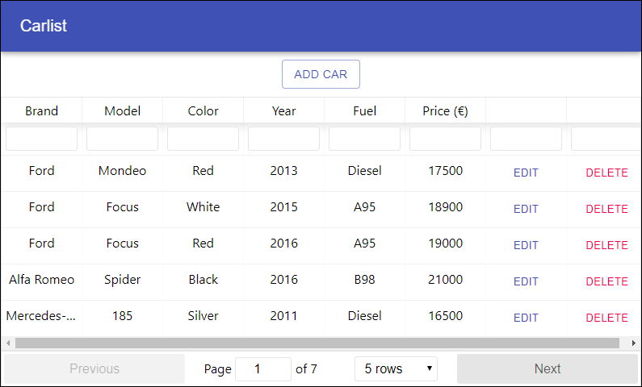

# Front-end--ohjelmointi
React, YARN, npm, Node.js, JavaScript, React-table, React router, Material-UI.

# Terminaali komennot
Projektin alustus, Material-UI ja React table asennus.
```
npx create-react-app carfront
cd carfront
yarn add @material-ui/core
yarn add @material-ui/icons
yarn add react-table-v6
yarn start
```

## Tehtävä
**21_Car_Shop** - Carshop tietokanta, josta voidaan muokata, poistaa ja lisätä autoja. 


## Lähteet
Juha Hinkula 2020, Haaga-Helia: Front end -ohjelmointi kurssi SWD4TN026-3003. \
React table v6: https://github.com/tannerlinsley/react-table/tree/v6#installation \
Navigation bar: https://material-ui.com/components/app-bar/ \
Fetch functions: https://github.com/github/fetch \
Delete button styles: https://material-ui.com/components/buttons/ \
Popup messages after deletion: https://material-ui.com/components/snackbars/ \
Dialog box: https://material-ui.com/components/dialogs/
