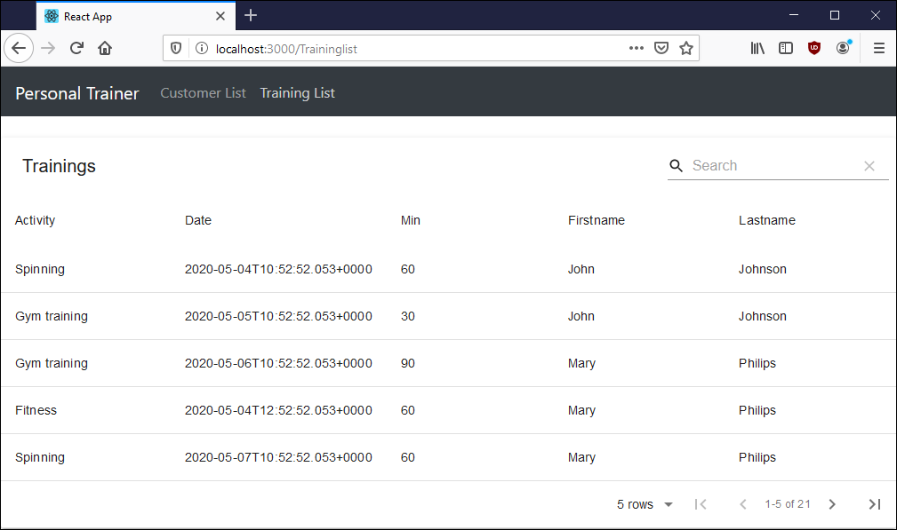

# Front-end--ohjelmointi
React, YARN, npm, Node.js, JavaScript, Material-table, Material-icons, React-router-dom, Material-bar, Material-UI.

# Terminaali komennot
Projektin alustus, Material-UI ja React table asennus.
```
npx create-react-app trainer
cd trainer
yarn add @material-ui/core
yarn add @material-ui/icons
yarn add material-table
yarn add react-router-dom
yarn add bootstrap
yarn start
```

## Tehtävä
**22Personal_trainer_material_table** - Henkilökohtainen valmentaja tietokanta front-end, josta voidaan hakea ja lajitella asiakkaita. \
 \

 \


## Lähteet
Juha Hinkula 2020, Haaga-Helia: Front end -ohjelmointi kurssi SWD4TN026-3003. \
Material table: https://github.com/mbrn/material-table \
Navigation bar: https://material-ui.com/components/app-bar/ \
Fetch functions: https://github.com/github/fetch \
React-moment: https://www.npmjs.com/package/react-moment
