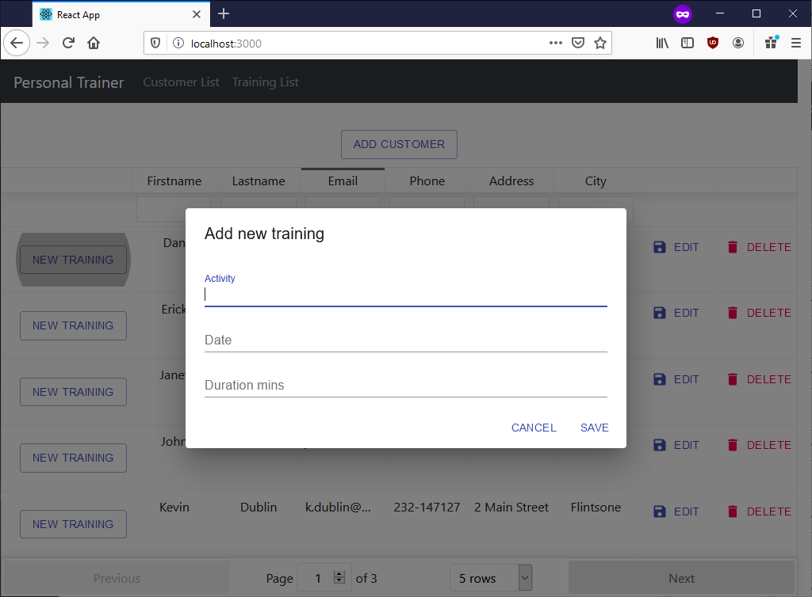

# Front-end--ohjelmointi
School project by Joni Hakala [(Dunttus)](http://dunttus.com/). \
React, YARN, npm, Node.js, JavaScript, React-table, Material-icons, Material-bar, Material-UI.

# Terminaali komennot
Projektin alustus, Material-UI ja React table asennus.
```
npx create-react-app trainer
cd trainer
yarn add @material-ui/core
yarn add @material-ui/icons
yarn add react-table-v6
yarn add react-router-dom
yarn add bootstrap
yarn add moment react-moment
yarn start
```

## Tehtävä
**22Personal_trainer** - Henkilökohtainen valmentaja tietokanta front-end, josta voidaan hakea, lajitella, lisätä ja poistaa asiakkaita. \
\
Customer list alkusivu

\
Customer list asiakas lisäys

\
Customer list asiakas muokkas

\
Customer list asiakas poisto

\
Customer list uusi treenaus

\
Trainings list alkusivu

\
Trainings list treenin poisto

\
## Todo
Customerlist asiakkaille ajan varaus nappi toimimaan \ 
Traininglist moment ajat toimimaan sanoo invalid date miten korjataan

## Lähteet
Juha Hinkula 2020, Haaga-Helia: Front end -ohjelmointi kurssi SWD4TN026-3003. \
React table v6: https://github.com/tannerlinsley/react-table/tree/v6#installation \
Navigation bar: https://material-ui.com/components/app-bar/ \
Fetch functions: https://github.com/github/fetch \
React router: https://reacttraining.com/react-router/
Bootstrap Navbars: https://getbootstrap.com/docs/4.4/examples/
Reacht-moment: https://www.npmjs.com/package/react-moment
